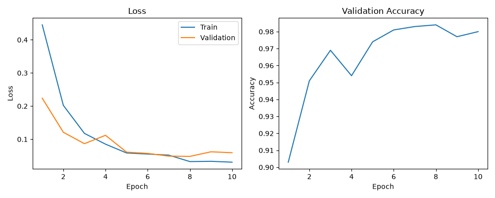
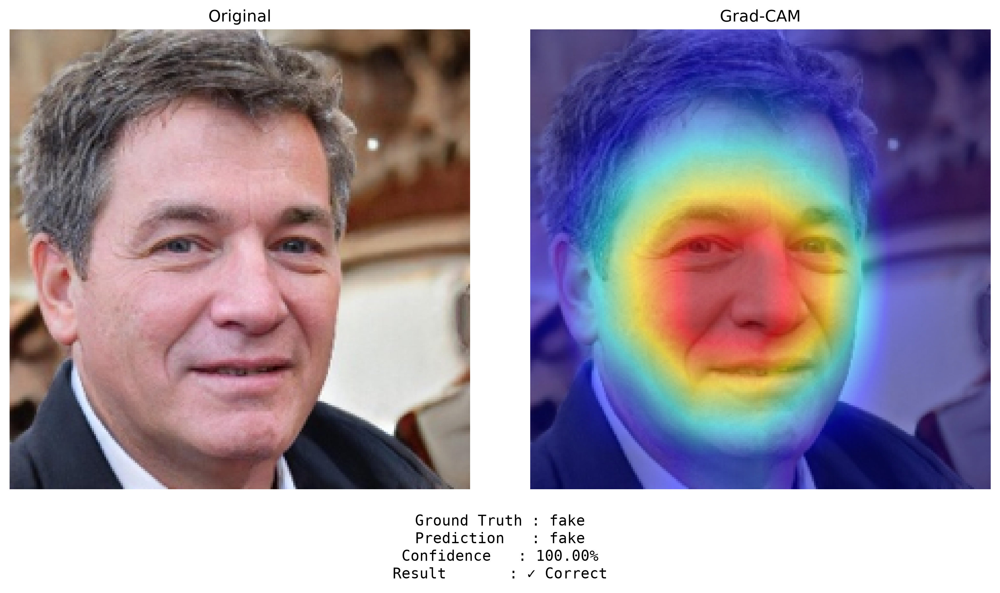
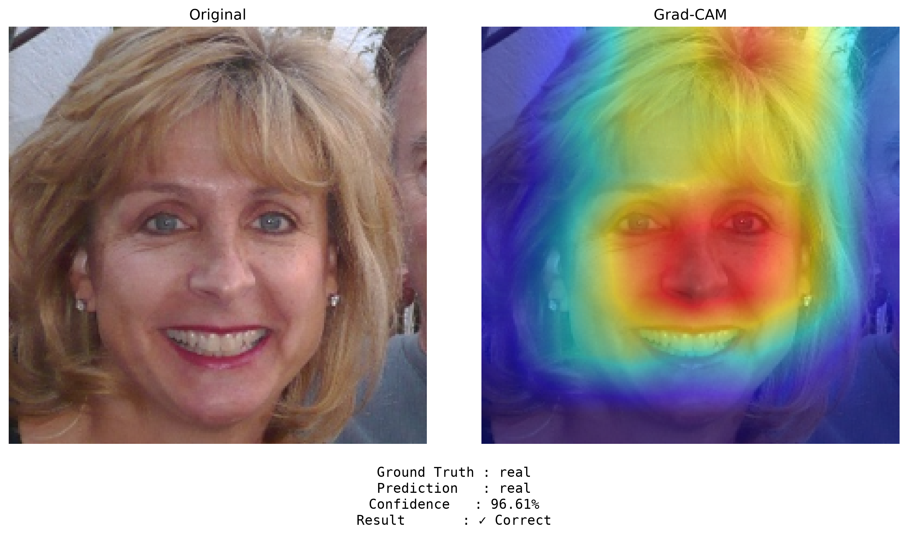
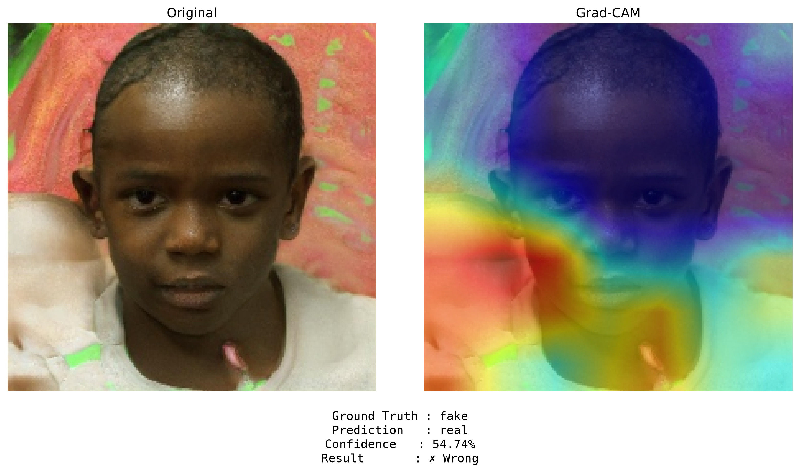
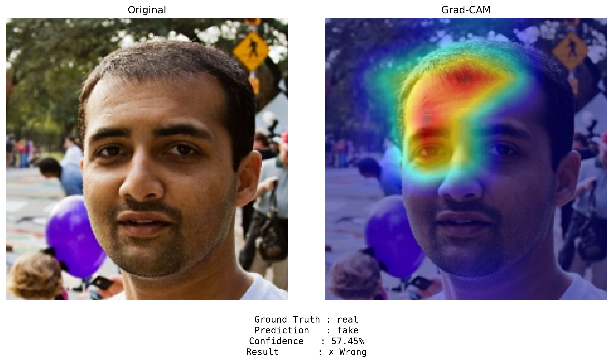
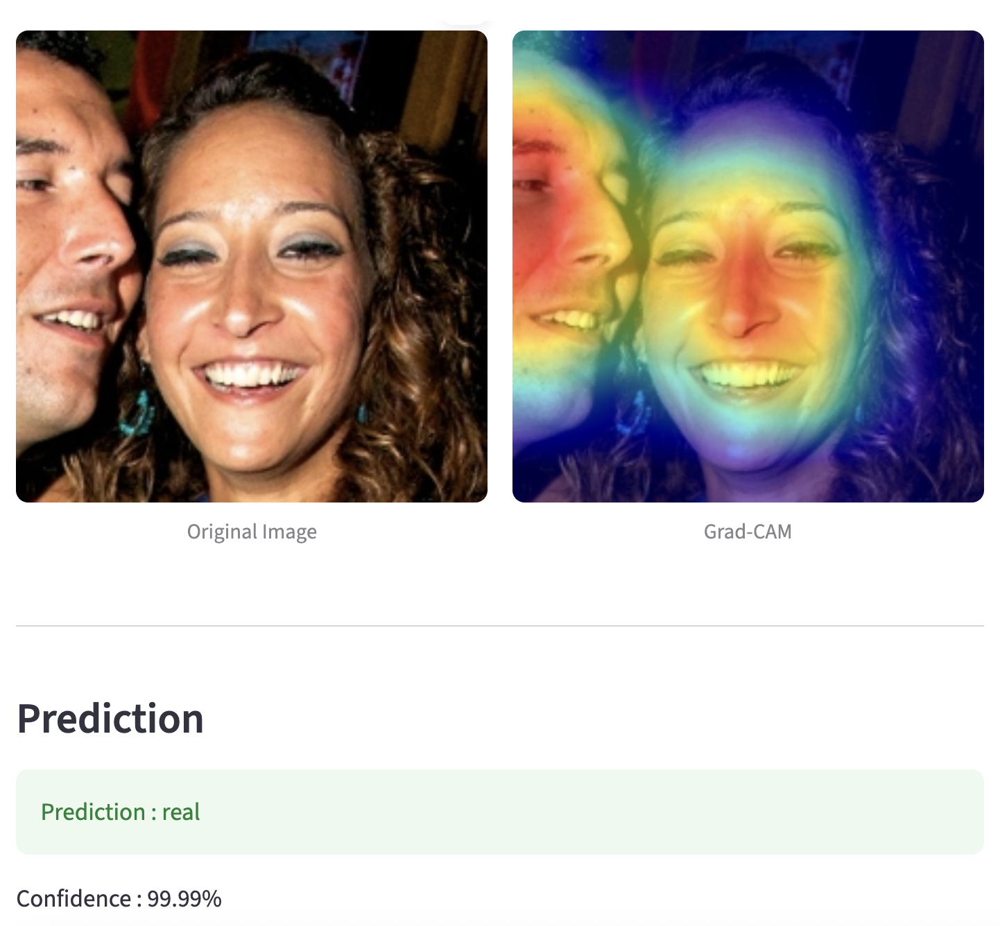
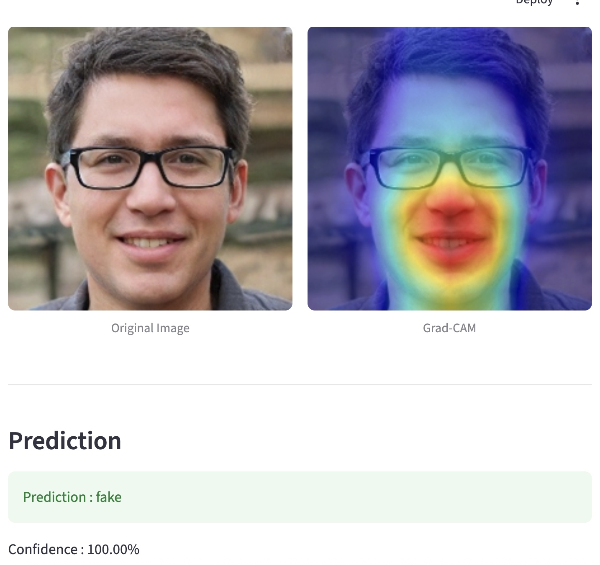

# Deepfake Detection with Explainable AI

> EfficientNet-B0와 Grad-CAM을 활용한 딥페이크 이미지 탐지 및 설명 가능한 AI(XAI) 프로젝트

---

# 프로젝트 소개

최근 생성형 AI와 딥페이크 기술의 발전으로 인해 조작된 이미지의 진위를 판별하는 기술의 중요성이 증가하고 있습니다.

본 프로젝트에서는 **EfficientNet-B0** 기반 딥러닝 모델을 이용하여 FaceForensics++ 데이터셋의 Real/Fake 이미지를 분류하였으며, **Grad-CAM**을 적용하여 모델이 어떤 영역을 근거로 예측했는지 시각적으로 확인할 수 있도록 구현하였습니다.

또한 **Streamlit** 기반 웹 애플리케이션을 개발하여 사용자가 이미지를 업로드하면 실시간으로 예측 결과와 Grad-CAM을 확인할 수 있도록 구현하였습니다.

---

# 주요 기능

- ✅ FaceForensics++ 기반 딥페이크 이미지 분류
- ✅ EfficientNet-B0 Transfer Learning
- ✅ Accuracy / Precision / Recall / F1-score 평가
- ✅ Grad-CAM 기반 Explainable AI
- ✅ Streamlit 실시간 추론 서비스
- ✅ 오분류 사례 분석

---

# 기술 스택

| Category | Technology |
|-----------|------------|
| Language | Python |
| Framework | PyTorch |
| Model | EfficientNet-B0 |
| XAI | Grad-CAM |
| Visualization | Matplotlib |
| Web | Streamlit |
| Evaluation | Scikit-learn |

---

# 프로젝트 구조

```text
Deepfake-Detection-XAI
│
├── app
│   └── app.py
│
├── src
│   ├── dataset.py
│   ├── model.py
│   ├── train.py
│   ├── evaluate.py
│   ├── gradcam.py
│   ├── eda.py
│   └── sample_dataset.py
│
├── assets
│   ├── history.png
│   ├── streamlit_demo1.png
│   ├── streamlit_demo2.png
│   └── gradcam
│
├── outputs
├── requirements.txt
└── README.md
```

---

# 데이터셋

본 프로젝트는 **FaceForensics++** 데이터셋을 기반으로 학습을 수행하였습니다.

빠른 실험과 반복적인 모델 개선을 위해 Mini Dataset을 구성하여 사용하였습니다.

| Split | Real | Fake | Total |
|--------|------|------|------:|
| Train | 2,500 | 2,500 | 5,000 |
| Validation | 500 | 500 | 1,000 |
| Test | 500 | 500 | 1,000 |

---

# 모델

ImageNet으로 사전학습된 **EfficientNet-B0**를 사용하였으며 마지막 Fully Connected Layer를 Binary Classification에 맞게 수정하였습니다.

```
Input Image
      │
      ▼
EfficientNet-B0
      │
      ▼
Fully Connected Layer
      │
      ▼
 Real / Fake
```

---

# 학습 환경

| 항목 | 값 |
|------|----|
| Model | EfficientNet-B0 |
| Image Size | 224 × 224 |
| Batch Size | 32 |
| Optimizer | Adam |
| Learning Rate | 0.0001 |
| Loss Function | CrossEntropyLoss |
| Epoch | 10 |
| Transfer Learning | O |

---

# 학습 결과

<p align="center">
  
</p>

### Training Analysis

- 초반 Epoch에서 Loss가 급격히 감소하며 빠르게 학습이 진행되었습니다.
- Validation Accuracy는 Epoch 5 이후 97% 이상을 유지하며 안정적으로 수렴하였습니다.
- Epoch 8에서 최고 Validation Accuracy(98.4%)를 기록하였으며 이후 과적합 없이 안정적인 성능을 유지하였습니다.
- Train Loss와 Validation Loss의 차이가 크지 않아 일반화 성능 또한 우수한 것으로 확인되었습니다.

---

# 최종 성능

| Metric | Score |
|---------|-------|
| Accuracy | **97.80%** |
| Precision | **99.38%** |
| Recall | **96.20%** |
| F1-score | **97.76%** |

### 결과 분석

- 약 **98%의 높은 정확도**를 달성하였습니다.
- Precision이 매우 높아 Fake라고 판단한 이미지의 대부분이 실제 Fake였습니다.
- Recall이 Precision보다 다소 낮은 이유는 일부 Fake 이미지를 Real로 오분류한 사례가 존재하기 때문입니다.
- F1-score 역시 97% 이상으로 Precision과 Recall의 균형이 우수한 모델임을 확인하였습니다.

---

# Explainable AI (Grad-CAM)

Grad-CAM을 이용하여 모델이 어떤 영역을 참고하여 예측을 수행했는지 시각화하였습니다.
모든 테스트 이미지에 대해 아래와 같이 자동 분류하여 저장하였습니다.

```text
outputs/gradcam

├── fake_correct
├── fake_wrong
├── real_correct
└── real_wrong
```

---

## Correct Prediction (Fake)

<p align="center">
  
</p>

모델은 얼굴 중심부와 눈, 코, 입 주변을 집중적으로 참고하여 Fake 이미지를 올바르게 분류하였습니다.

---

## Correct Prediction (Real)

<p align="center">
  
</p>

Real 이미지 역시 얼굴 전체의 특징을 중심으로 판단하는 경향을 확인할 수 있었습니다.

---

## Misclassified Fake

<p align="center">
  
</p>

Fake 이미지임에도 불구하고 Real로 분류한 사례입니다.
Grad-CAM 결과를 보면 얼굴보다 배경과 하단 영역에 집중하는 경향이 나타났으며 이러한 Attention의 분산이 오분류의 원인으로 추정됩니다.

---

## Misclassified Real

<p align="center">
  
</p>

Real 이미지를 Fake로 오분류한 사례입니다.
얼굴 전체보다 특정 영역에 집중하면서 Fake 특징으로 오인한 것으로 보입니다.

---

# Streamlit Demo

사용자는 이미지를 업로드하면

- Original Image
- Prediction
- Confidence Score
- Grad-CAM

을 실시간으로 확인할 수 있습니다.

<p align="left">
  
</p>
<p align="right">
  
</p>

실행 방법

```bash
streamlit run app/app.py
```

---

# 한계점

본 모델은 FaceForensics++ 데이터셋 기반으로 학습되었기 때문에 동일한 데이터 분포에서는 높은 성능을 보였습니다.
그러나 생성형 AI 이미지(GPT Image, Midjourney, Stable Diffusion 등)와 같이 학습되지 않은 데이터에서는 일반화 성능이 저하될 가능성이 있습니다.

또한 일부 오분류 사례에서는 얼굴보다 배경이나 주변 영역에 Attention이 집중되는 현상을 확인하였습니다.

---

# 향후 계획

- Cross-Dataset Evaluation
- Celeb-DF 및 DFDC 데이터셋 추가 평가
- Out-of-Distribution(OOD) 이미지 분석
- Confidence Calibration
- 다양한 Explainable AI 기법 비교
- 모델 일반화 성능 향상

